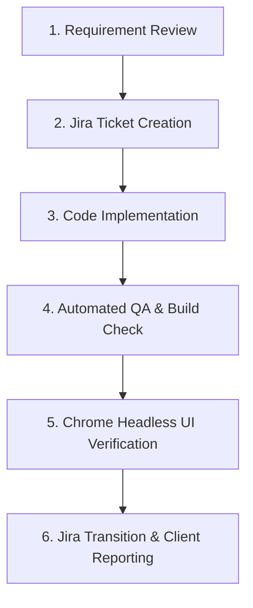

# 🛠️ Agent Engineering Guidelines & Project Methods Standard
**Surat Embroidery Micro-ERP (EBTM / ETMS)**

---

## 1. System Architecture & Port Mapping

| Component | Codebase Path | Technology Stack | Port | Primary Responsibility |
|---|---|---|---|---|
| **OPS Backend** | `/mnt/Bhasker/EBTM/OPS/backend` | Express / Node 20 / Postgres / Mongo | `5000` | SaaS Super-Admin, Tenant Provisioning & Global Audit Logs |
| **OPS Frontend** | `/mnt/Bhasker/EBTM/OPS/frontend` | Vite / React 19 / Vanilla CSS | `3000` | Super-Admin Dashboard & Tenant Directory Management |
| **ETMS Backend** | `/mnt/Bhasker/EBTM/ETMS/backend` | NestJS 10 / Sequelize / Redis | `4000` | SAC 9988 Billing, Karigar Hisab, Munim & Tally Engine |
| **ETMS Frontend** | `/mnt/Bhasker/EBTM/ETMS-FE` | Next.js 14.2 / Tailwind / PWA | `3002` | Factory Floor Telemetry, Voice Logger, PWA & Thermal Slips |

---

## 2. Standardized Agent Execution Protocol

All AI agents and developers working on the EBTM project **must strictly adhere** to the following 6-step lifecycle for all tasks:

### Step 1: Requirement Review
- Review Jira issue summaries, codebase context, and existing Knowledge Items (KIs).
- Cross-reference existing NestJS/Next.js services before creating duplicate logic.

### Step 2: Jira Ticket Creation (Mandatory)
- **Every task or feature MUST be created in Jira** under project key `SCRUM` prior to execution or reporting.
- Jira tickets must include concise summaries, technical specifications, and clear acceptance criteria.

### Step 3: Code Implementation
- Follow domain-driven modular structure (`src/modules/*` in NestJS, `src/app/*` in Next.js).
- Enforce strict tenant isolation (`x-company-id: <UUID>`) on all endpoints.

### Step 4: Automated QA & Build Verification
- Execute `npm test` in `OPS/backend` (must achieve **100% pass rate**).
- Execute `nest build` in `ETMS/backend` and `next build` in `ETMS-FE` to ensure zero compilation warnings or errors.

### Step 5: Chrome Headless UI Verification
- Launch Google Chrome to load the live dev servers (`http://localhost:3000` and `http://localhost:3002`).
- Capture high-resolution screenshot/video artifacts to verify visual design, responsiveness, and backend API connectivity (`:4000 Connected`).

### Step 6: Jira Transition & Final Reporting
- Transition completed Jira tickets to `Done` using the Atlassian API.
- Produce a structured markdown report listing Jira ticket keys, summaries, test metrics, and screenshot references.

---

## 3. Dynamic i18n & Single-Language Architecture Standard (MANDATORY)

> [!IMPORTANT]
> **Zero Static Strings & Single Active Language Policy**:
> Whenever creating or modifying any **new feature, new module, new drawer, new modal, new page, new component, new toast alert, or new print slip**, the following standards are strictly mandatory:

### Core Rules:
1. **No Hardcoded Static Text**:
   - Zero raw text strings in JSX/TSX elements.
   - All text, titles, subtitles, placeholders, labels, table columns, chips, buttons, and toast alerts **must** be retrieved dynamically via `useI18n()` (`t.<key>` or `translate(key)`).
2. **Single Active Language (Never Mix Languages)**:
   - Only **one language active at a time** based on user settings.
   - **Never combine multiple languages together** (e.g. ❌ `"Shift Log / શિફ્ટ લોગ"`, ❌ `"Edit Karigar (કારીગર સુધારો)"`).
3. **Controlled Globally by Header Language Settings**:
   - The active language is governed by the **Header Language Switcher** (`Navbar.tsx` -> `LanguageSwitcher.tsx`).
   - `I18nProvider` syncs selection to `localStorage['etms_lang']` and `document.documentElement.lang`.
   - All drawers and views must react dynamically without requiring page reloads.
4. **Complete 8-Language Dictionary Coverage**:
   - Every new key added to `src/lib/translations/en.ts` must also be translated in:
     - `gu.ts` (Gujarati)
     - `hi.ts` (Hindi)
     - `mr.ts` (Marathi)
     - `ta.ts` (Tamil)
     - `te.ts` (Telugu)
     - `kn.ts` (Kannada)
     - `bn.ts` (Bengali)
5. **Standardized Key Naming**: `<module>_<section>_<element>` (e.g. `karigar_drawer_addTitle`, `shift_stats_totalOutput`, `invoice_table_headerGst`).
